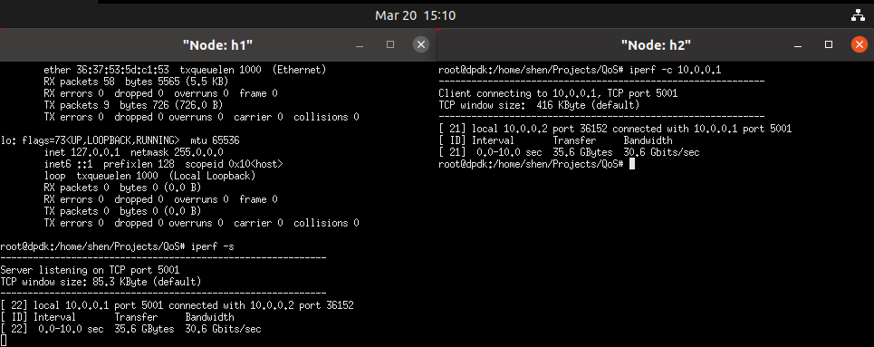
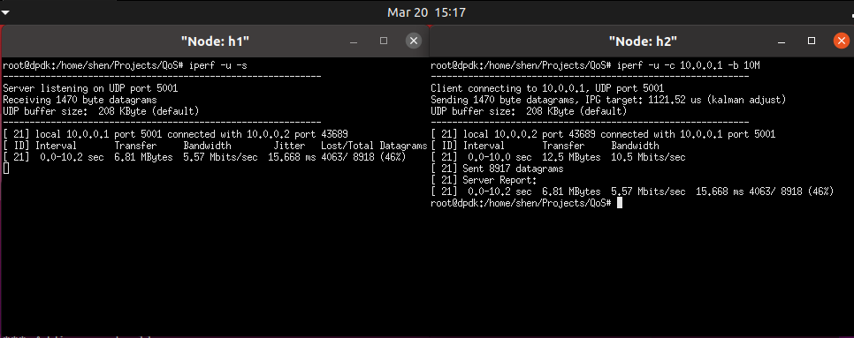
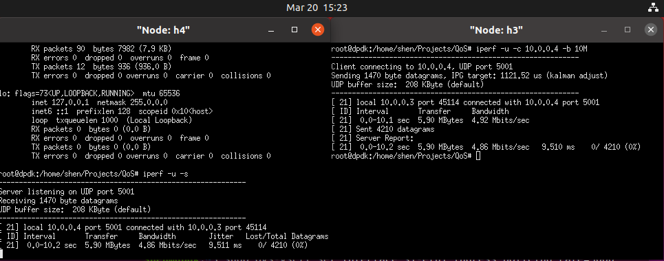
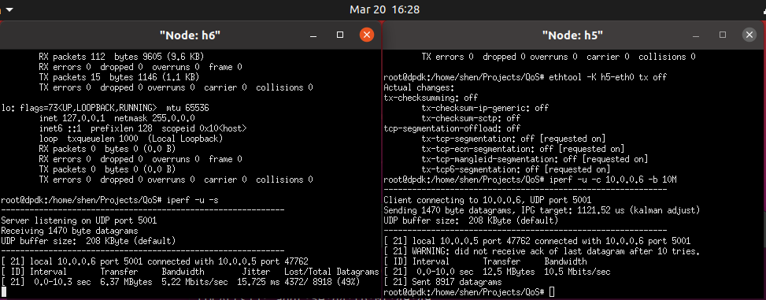
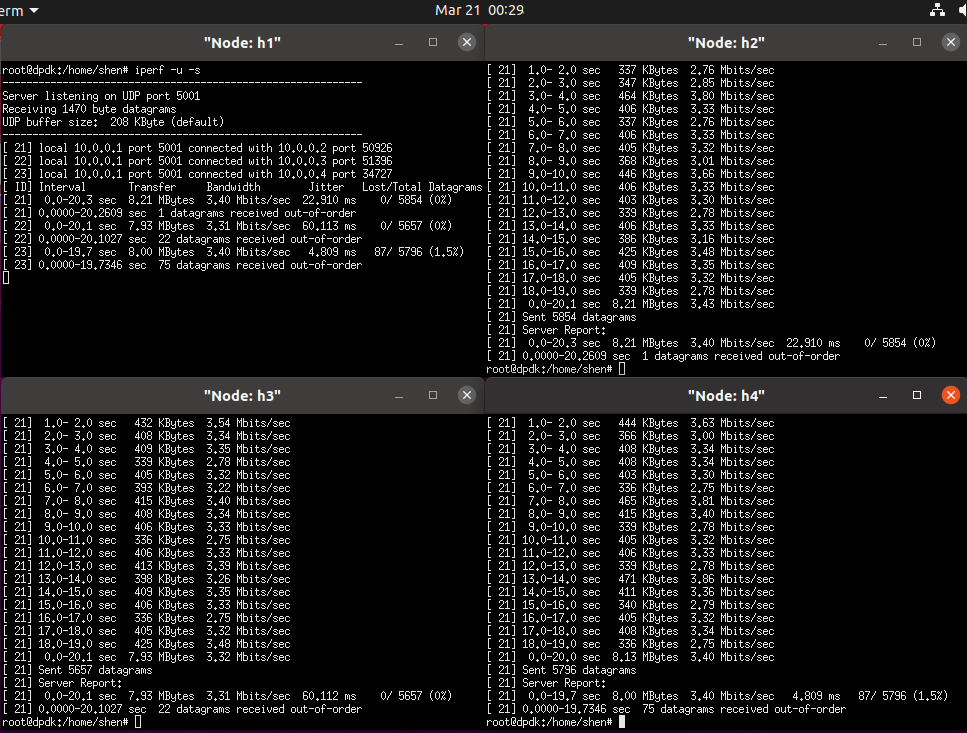
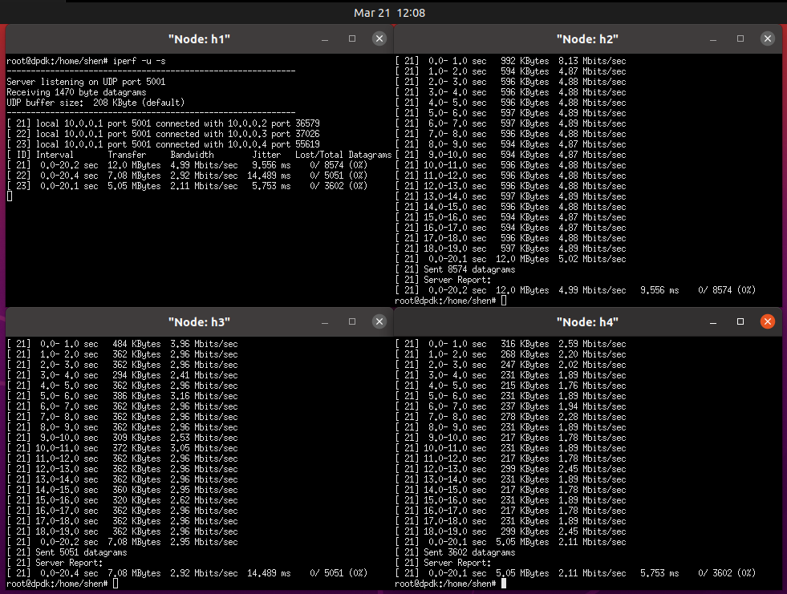

# Lab3 - QoS Implementation with OvS

沈玮杭 519021910766

#### Task1



<center>图1 Task1 连通性测试</center>

#### Task2.1



<center>图2 Task2.1 网卡限速</center>

#### Task2.2



<center>图3 Task2.2 队列限速</center>

#### Question1

Line15的指令表示给交换机s1下发流表，其中`in_port=5`和`output:6`表示数据流入口是端口5（即h5），出口是端口6，`action=meter:1`表示使用刚刚创建的1号meter表。`-O OpenFlow13`指定协议版本，否则会出现报错信息：`(we support version 0x01, peer supports version 0x04)`。

Line16的指令表示下载并查看交换机s1上的流表，`-O OpenFlow13`同样表示指定协议版本。


#### Task2.3



<center>图4 Task2.3 Meter表限速</center>

#### Question2

<center>表1 三种类型的限速结果</center>

| 类型        | 带宽（Mbits/sec） | 抖动（ms） | 丢包率（%） |
| ----------- | ----------------- | ---------- | ----------- |
| 网卡限速    | 5.57              | 15.668     | 46          |
| 队列限速    | 4.86              | 9.511      | 0           |
| Meter表限速 | 5.22              | 15.725     | 49          |

从上表可以看出队列限速的效果最好，带宽控制最为严格，且抖动最小，丢包率也为0。这是由于它使用了一个队列来缓存和调度数据包的发送，可以实现流量整形（shaping）的效果，因此更加平滑，抖动较小，带宽控制精确，丢包率很低。

而网卡限速采用的是policing，超过限制速度后会简单地将数据包丢弃，因此丢包率很高，并且由于丢弃包，导致了抖动也变大了。

Meter表也是设置了`band=type=drop`，通过丢弃包来实现速率控制，因此效果与网卡限速相差无几。

并且由于丢包，并且使用的是udp包测速，iperf的发送端“以为”自己把包发出去了，因此client端的测试结果与server端不一致，要以server report为准。


#### Task3

使用了队列限速的方式将server端限速为`10Mbits/sec`。

```bash
sudo ovs-vsctl set port s1-eth1 qos=@newqos -- \
--id=@newqos create qos type=linux-htb queues=0=@q0 -- \
--id=@q0 create queue other-config:max-rate=10000000
```



<center>图5 Task3场景模拟</center>

从图中可以看出稳定下来后3个client的速度基本是平均分配的，分别为`3.40Mbits/sec`、`3.31Mbits/sec`和`3.40Mbits/sec`，总和为`10.11Mbits/sec`。


#### Task4

QoS采用了带优先级的队列模式，3个client分别使用指定的队列，并且为h2和h3指定队列的最小速率。为了使得h4在保证h2和h3的前提下带宽尽量大，因此优先级适当设置的高一些，并且可以通过queue的min-rate属性来保证h2和h3的带宽。

```bash
# 清空前面的qos
sudo ovs-vsctl clear port s1-eth1 qos
sudo ovs-vsctl -- --all destroy qos -- --all destroy queue

# 创建qos以及队列
sudo ovs-vsctl set port s1-eth1 qos=@qos1 -- \
--id=@qos1 create qos type=linux-htb \
other-config:max-rate=10000000 queues=0=@q0,1=@q1,2=@q2 -- \
--id=@q0 create queue other-config:priority=1 other-config:min-rate=5000000 -- \
--id=@q1 create queue other-config:priority=2 other-config:min-rate=3000000 -- \
--id=@q2 create queue other-config:priority=0

# 下发流表，让数据流进入指定的队列
sudo ovs-ofctl add-flow s1 in_port=2,actions=set_queue:0,output:1 -O openflow13
sudo ovs-ofctl add-flow s1 in_port=3,actions=set_queue:1,output:1 -O openflow13
sudo ovs-ofctl add-flow s1 in_port=4,actions=set_queue:2,output:1 -O openflow13


# h1上运行
iperf -u -s

# h2、h3、h4上运行
iperf -u -c 10.0.0.1 -b 10M -t 20 -i 1
```



<center>图6 Task4 QoS设计</center>

从上图可以看到，稳定后h2的带宽为`4.99Mbits/sec`，基本满足h2的带宽需求。h3的带宽为`2.92Mbits/sec`，基本满足了h3的带宽要求。h4的带宽为`2.11Mbits/sec`，是在保证h2和h3的前提下的最大带宽。clients带宽和为`10.02Mbits/sec`，即server的带宽限制。同时，clients的抖动也在合理范围内，丢包率均为0，QoS效果较为理想。

