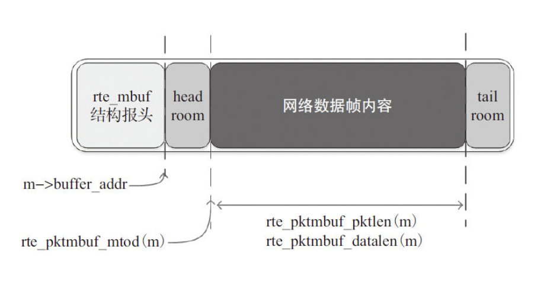
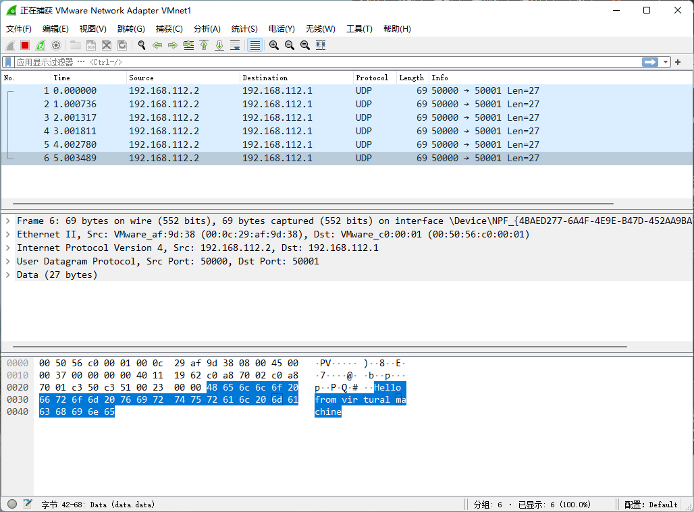

# CloudOS-Labs


#### Lab 1 - Reliable Data Transport Protocol (RDT)

## Lab 2 - Send and Receive Packets with DPDK

### Part 1: Get familiar with DPDK

#### Q1: What's the purpose of using hugepage?

大页可以减少程序所使用的页表项，减少TLB miss的次数，从而加速地址的翻译。

使用大页也可以减少页表的级数，可以提高查页表的效率。


#### Q2: Take `examples/helloworld` as an example, describe the execution flow of DPDK programs?

1. 初始化运行环境
2. 调用`rte_eal_remote_launch()`来初始化多核运行环境
3. 在各worker logic core上调用`lcore_hello()`
4. 在main logic core上调用`lcore_hello()`
4. 等待各logic core完成执行
4. 清除运行时环境并退出


#### Q3: Read the codes of `examples/skeleton`, describe DPDK APIs related to sending and receiving packets.

sending packets:

```c
static inline uint16_t
rte_eth_tx_burst(uint16_t port_id, uint16_t queue_id,
                 struct rte_mbuf **tx_pkts, uint16_t nb_pkts);
```

`rte_eth_tx_burst`可以指定`port_id`端口和`queue_id`队列，从`tx_pkts`数组内发送`nb_pkts`个包。


receiving packets:

```c
static inline uint16_t
rte_eth_rx_burst(uint16_t port_id, uint16_t queue_id, 
                 struct rte_mbuf** rx_pkts, const uint16_t nb_pkts);
```

`rte_eth_tx_burst`可以指定`port_id`端口和`queue_id`队列，接收发送`nb_pkts`个包到`rx_pkts`数组。


#### Q4: Describe the data structure of `rte_mbuf`.



<center>图1 rte_mbuf结构（图源《深入浅出DPDK》图6-8）</center>

如图1所示，`rte_mbuf`中包含前面的结构报头和后面的数据帧内容，可以由`rte_pktmbuf_alloc()`函数分配得到。数据部分前后留有空余，这样在解包和封包的时候只需要操作前后的`headroom`和`tailroom`即可，可以减少中间数据的反复拷贝，提升性能。


### Part 2: Send packets with DPDK

####  Preparation

```bash
# mount hugepage
mkdir -p /dev/hugepages
mountpoint -q /dev/hugepages || mount -t hugetlbfs nodev /dev/hugepages
sudo sh -c 'echo 64 > /sys/devices/system/node/node0/hugepages/hugepages-2048kB/nr_hugepages'

# bind NIC
sudo ifconfig ens33 down
sudo modprobe uio
cd ~/dpdk/kernel/linux/igb_uio
make
sudo insmod igb_uio.ko
cd ../../..
sudo usertools/dpdk-devbind.py --bind=igb_uio ens33
sudo usertools/dpdk-devbind.py -s
```


#### Build & Run

```bash
make
sudo ./build/dpdk_udp
```


#### Results



<center>图2 抓包截图</center>

可以看到能成功地在宿主机里抓到包。
